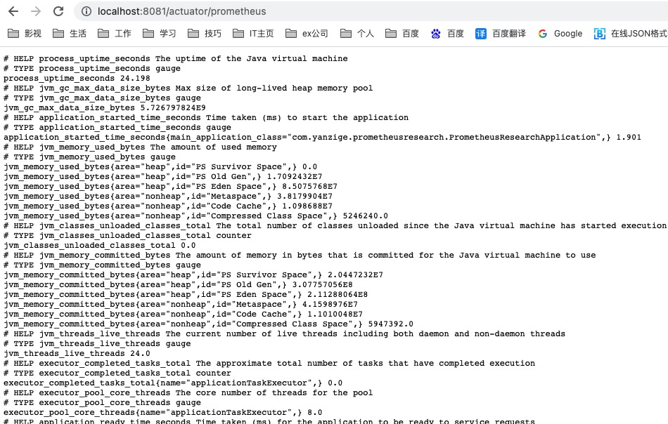
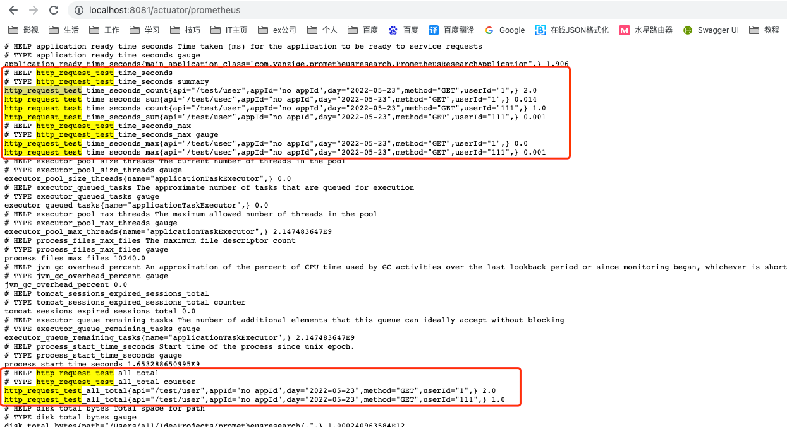
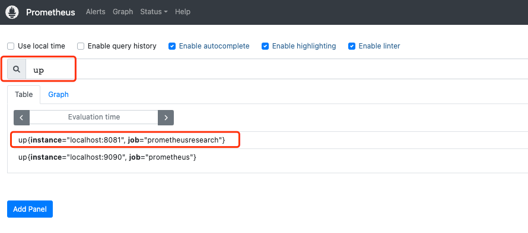
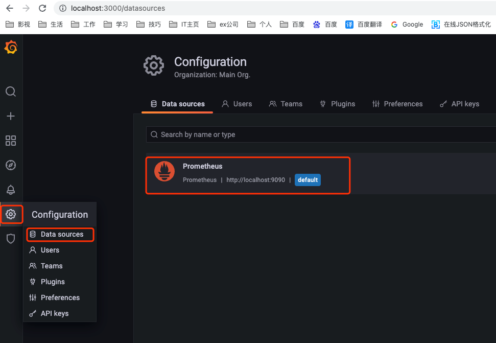
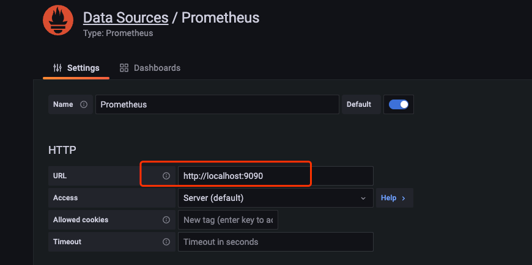
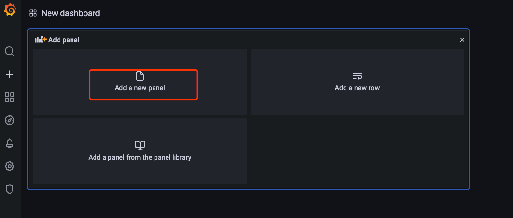
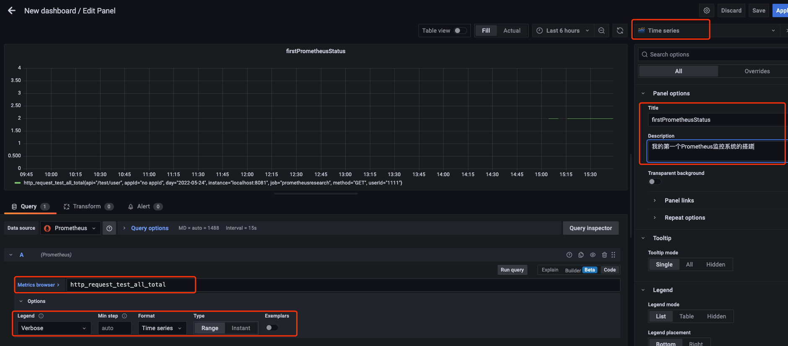
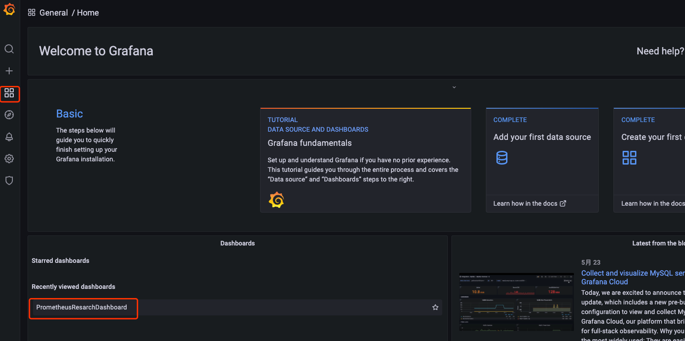
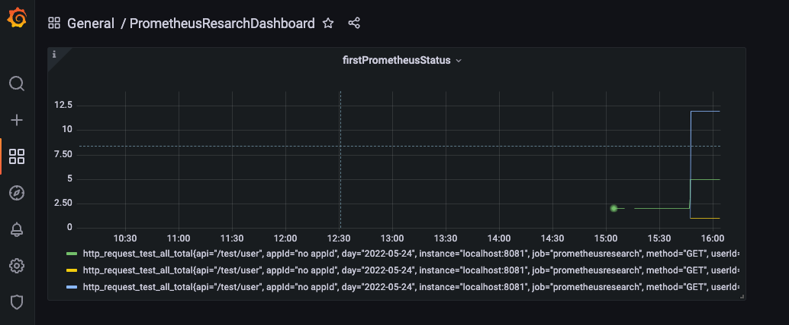

# Prometheus 监控搭建

### 说明
* 当前电脑为Mac，该操作基于Mac演示
* springboot的actuator可以很好的配合prometheus实现项目的监控

### 步骤
#### 1、导入prometheus对应的jar包
```xml
        <dependency>
            <groupId>io.micrometer</groupId>
            <artifactId>micrometer-registry-prometheus</artifactId>
            <scope>runtime</scope>
        </dependency>
```

#### 2、导入actuator对应的jar包
```xml
        <dependency>
            <groupId>org.springframework.boot</groupId>
            <artifactId>spring-boot-starter-actuator</artifactId>
        </dependency>
```

#### 3、编写切面代码，实现自定义监控指标
```java
package com.yanzige.prometheusresearch.aspect;

import io.micrometer.core.instrument.Metrics;
import org.aspectj.lang.ProceedingJoinPoint;
import org.aspectj.lang.annotation.Around;
import org.aspectj.lang.annotation.Aspect;
import org.aspectj.lang.annotation.Pointcut;
import org.springframework.stereotype.Component;
import org.springframework.util.StringUtils;
import org.springframework.web.context.request.RequestContextHolder;
import org.springframework.web.context.request.ServletRequestAttributes;

import javax.servlet.http.HttpServletRequest;
import java.time.LocalDate;
import java.util.Objects;
import java.util.concurrent.TimeUnit;

@Aspect
@Component
public class PrometheusMetricsAspect {

    // 切入所有controller包下的请求方法
    @Pointcut("execution(* com.yanzige.prometheusresearch.controller..*.*(..))")
    public void controllerPointcut() {
    }

    @Around("controllerPointcut()")
    public Object MetricsCollector(ProceedingJoinPoint joinPoint) throws Throwable {

        HttpServletRequest request = ((ServletRequestAttributes) Objects.requireNonNull(RequestContextHolder.getRequestAttributes())).getRequest();
        String userId = StringUtils.hasText(request.getParameter("userId")) ? request.getParameter("userId") : "no userId";
        String appId = StringUtils.hasText(request.getParameter("appId")) ? request.getParameter("appId") : "no appId";

        // 获取api url
        String api = request.getServletPath();
        // 获取请求方法
        String method = request.getMethod();
        long timeMillis = System.currentTimeMillis();
        LocalDate now = LocalDate.now();
        String[] tags = new String[10];
        tags[0] = "api";
        tags[1] = api;
        tags[2] = "method";
        tags[3] = method;
        tags[4] = "day";
        tags[5] = now.toString();
        tags[6] = "appId";
        tags[7] = appId;
        tags[8] = "userId";
        tags[9] = userId;
        // 请求次数加1
        //自定义的指标名称：http_request_test_all，指标包含数据
        Metrics.counter("http_request_test_all", tags).increment();
        Object object;
        try {
            object = joinPoint.proceed();
        } catch (Exception e) {
            // 请求失败次数加1
            Metrics.counter("http_request_test_error", tags).increment();
            throw e;
        } finally {
            long f = System.currentTimeMillis();
            long l = f - timeMillis;
            //记录请求响应时间
            Metrics.timer("http_request_test_time", tags).record(l, TimeUnit.MILLISECONDS);
        }
        return object;
    }
}
```
#### 4、编写入口类Controller测试代码
```java
package com.yanzige.prometheusresearch.controller;

import lombok.extern.slf4j.Slf4j;
import org.springframework.web.bind.annotation.GetMapping;
import org.springframework.web.bind.annotation.RequestMapping;
import org.springframework.web.bind.annotation.RequestParam;
import org.springframework.web.bind.annotation.RestController;

@RestController
@Slf4j
@RequestMapping("test")
public class TestController {

    @GetMapping("/user")
    public String getInfo(@RequestParam String userId) {
        log.info("userId:{}", userId);
        return "123";
    }

    @GetMapping("/app")
    public String getAppInfo(@RequestParam String appId) {
        log.info("appId:{}", appId);
        return "123456";
    }

    @GetMapping("/user/app")
    public String getUserAppInfo(@RequestParam String appId, @RequestParam String userId) {
        log.info("appId:{}", appId);
        log.info("userId:{}", userId);
        return "abc";
    }
}
```
#### 5、编辑application.properties配置信息
```properties
server.port=8081

spring.application.name=prometheusresearch

# 支持metrics
management.endpoint.metrics.enabled=true
# 开放端口
management.endpoints.web.exposure.include=*
# 支持prometheus
management.endpoint.prometheus.enabled=true
management.metrics.export.prometheus.enabled=true
```
#### 6、启动项目，如果运行结果如下，则表示prometheus正常启动


#### 7、测试接口：http://localhost:8081/test/user?userId=111 ，然后刷新http://localhost:8081/actuator/prometheus查看变化

从图片中可以看出来，展示的结构就是我们切面中定义的字段"api"、"method"、"day"、"appId"、"userId"和对应统计的调用次数。这里会自动将我们的指标加上后缀：_total 所以我们后续使用grafana查询的时候也要加上这个后缀。

#### 8、Prometheus的下载地址 https://prometheus.io/download/ 选择对应的操作系统进行下载安装，本人mac选着安装版本 prometheus-2.35.0.darwin-amd64.tar.gz
* 具体安装流程可以网上搜索，可查看地址 https://blog.csdn.net/hyq413950612/article/details/122704175
* 将下载的.tar.gz包放到某个目录下，然后进入Prometheus目录，启动命令 ./prometheus，后台启动 ./prometheus &
* 访问 http://localhost:9090 
* 修改Prometheus目录下的配置文件 vim prometheus.yml
```yaml
  # 新增配置，将springboot项目添加到监控中
  - job_name: "prometheusresearch"

    # metrics_path defaults to '/metrics'
    # scheme defaults to 'http'.
    metrics_path: /actuator/prometheus
    static_configs:
      - targets: ["localhost:8081"]
```
* 修改配置文件后，需要重新启动，最好指定修改配置文件启动 ./prometheus --config.file=/Users/a11/Config/prometheus-2.35.0.darwin-amd64/prometheus.yml
* 然后再次访问 http://localhost:9090，输入up 然后点击execute可以看到当前监控的job状态：1表示监控当中，0表示监控信息获取失败，显示如下图：

* 上一条，使用up进行查询，该命令输入PromQL的数据查询语法，可以进行百度搜索PromQL进行学习  

#### 9、Grafana的下载地址 https://grafana.com/grafana/download 选择对应的操作系统进行下载安装，本人mac选着安装版本 
* 具体安装流程可以网上搜索，官方安装指导可查看地址 https://grafana.com/docs/grafana/latest/installation/mac/
* 安装前如果需要用到Homebrew，请参考 https://zhuanlan.zhihu.com/p/90508170 或者关注公众号：湖中剑，也有安装说明
* 将下载下的.tar.gz包放到某个目录下，并且在该目录下进行启动，启动命令 ./bin/grafana-server web，后台启动 ./bin/grafana-server web &
* 访问 http://localhost:3000 即可展示 grafana 登录页面，用户名密码默认 admin/admin ，首次登录会要求修改新密码，但是新密码没有校验是否和旧密码一致，也就是说密码还是可以为 admin
* 在设置里面添加Prometheus数据源，输入地址 http://localhost:9090 即可进行保存


* 在图表中添加panel

* 配置需要监控数据和图表
    - 输入PromQL查询语句
    - 设置监控的参数
    - 设置展示的图表
    - 设置panel的名字和对应的描述
    - 最后注意右上角save保存


* 最后就可以在自己的dashboard面板中看到对应的监控图表


  
#### 10、参考地址 https://blog.csdn.net/ycf921244819/article/details/124665695
  
### 总结：到此，整个监控系统的搭建基本完成，所有对springboot项目接口的调用都可以通过Prometheus搜集反馈到Grafana的图形界面中来
